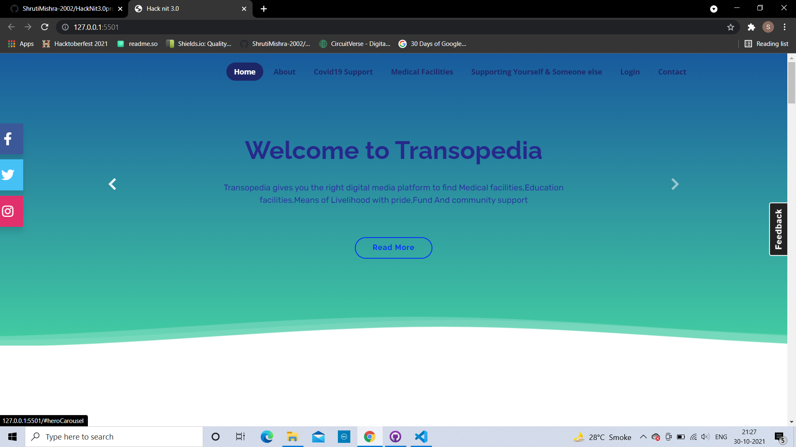
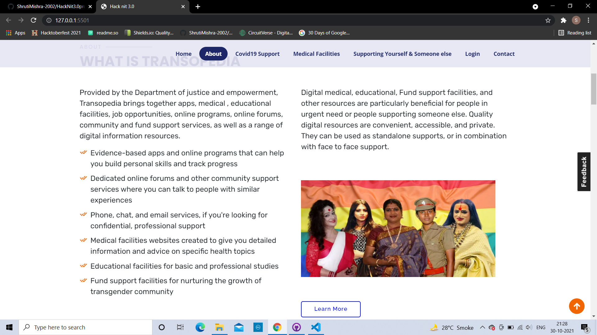
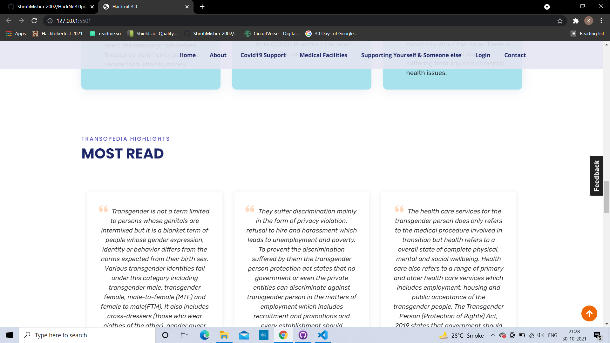
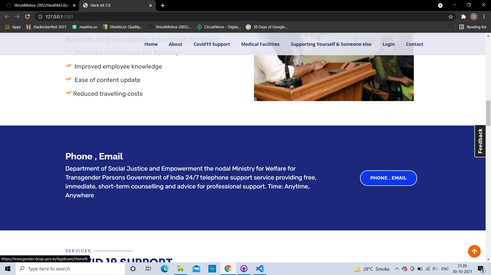
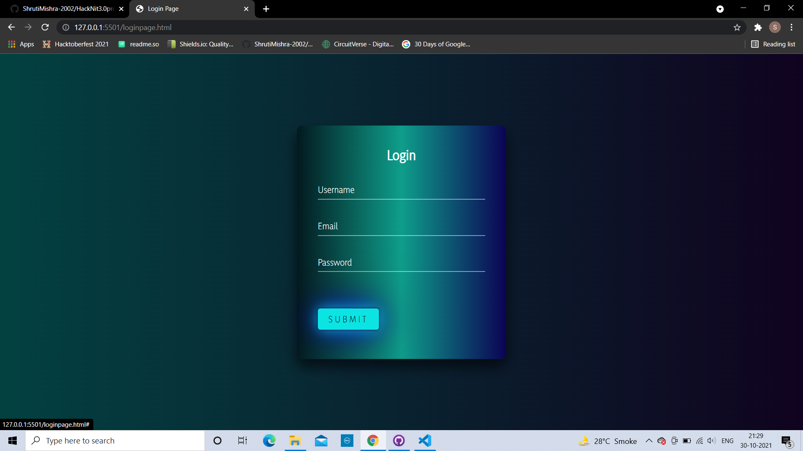
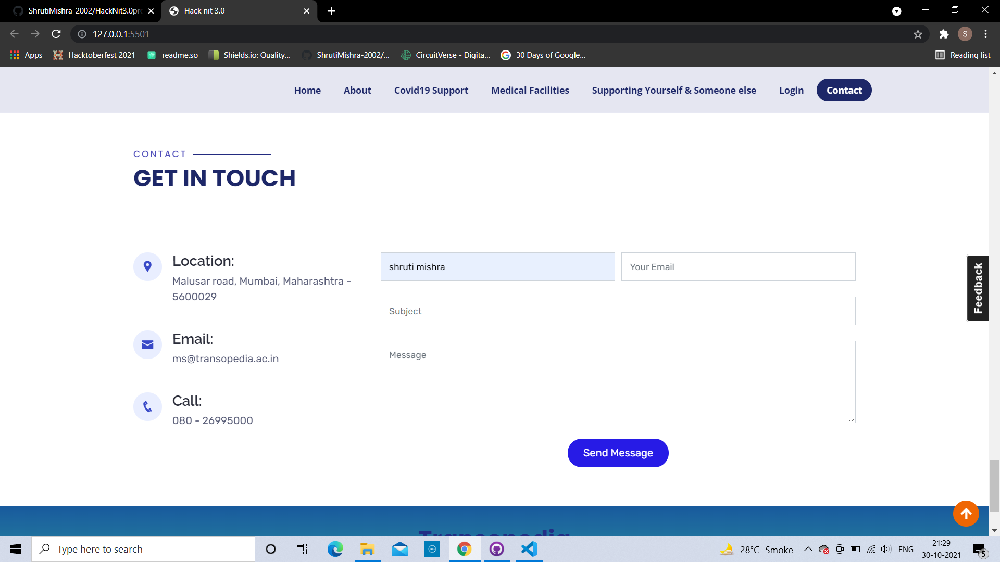

# HackNit3.0project
Transopedia is a website created to make difference in society as well as in the lifes of transgender community by providing different online and offline support including fund support

    

<h1 align="center"> TRANSOPEDIA </h1>

    <a href="https://github.com/ShrutiMishra-2002/HackNit3.0project"><strong>HERE IS THE REPO CONTENT</strong></a>
     
     
  

<!-- ABOUT THE PROJECT -->

## About The Project 

Transopedia is a website created to make difference in society as well as in the lifes of transgender community by providing different online and offline support including fund, education, medical, community, covid19, job / small business support. 

## Tools used

<h4>
<ul>
   <li> HTML >> Is used for the basic structuring and styling of the web pages.</li>
    <li>CSS >> Is used for the basic and advance styling of the page.</li>
    <li>JAVASCRIPT >> Is used for making the page responsive and working in all the ways.</li>
    <li>PHP >> Is used for login, contact, registration pages.</li>
</ul>
</h4>

## 📌 Getting Started with the content of website 
 
<h1>THE MAIN PAGE</h1>

   

   
   
   

<h1>ABOUT US PAGE </h1>

   
   

<h1>GALLERY PAGE</h1>

   
   

<h1>GOVERNMENT HELP DESK </h1>

   
   

<h1>LOGIN PAGE</h1>

   
   

<h1>CONTACT PAGE</h1>

   

